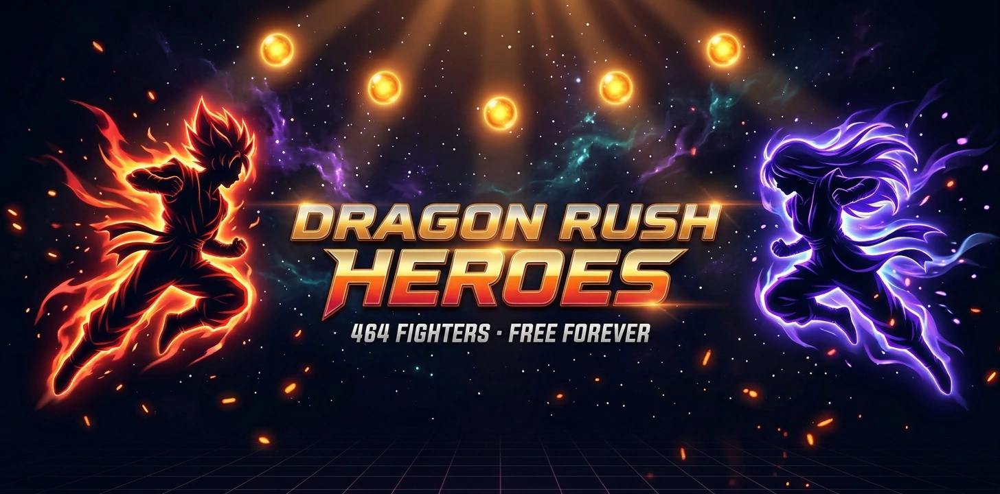
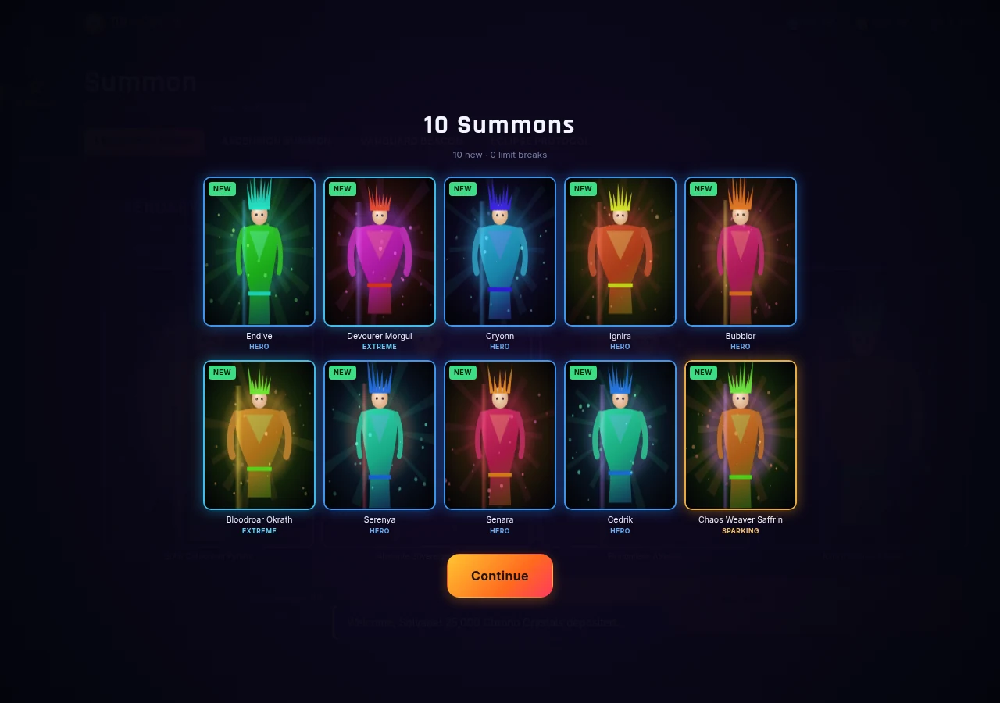
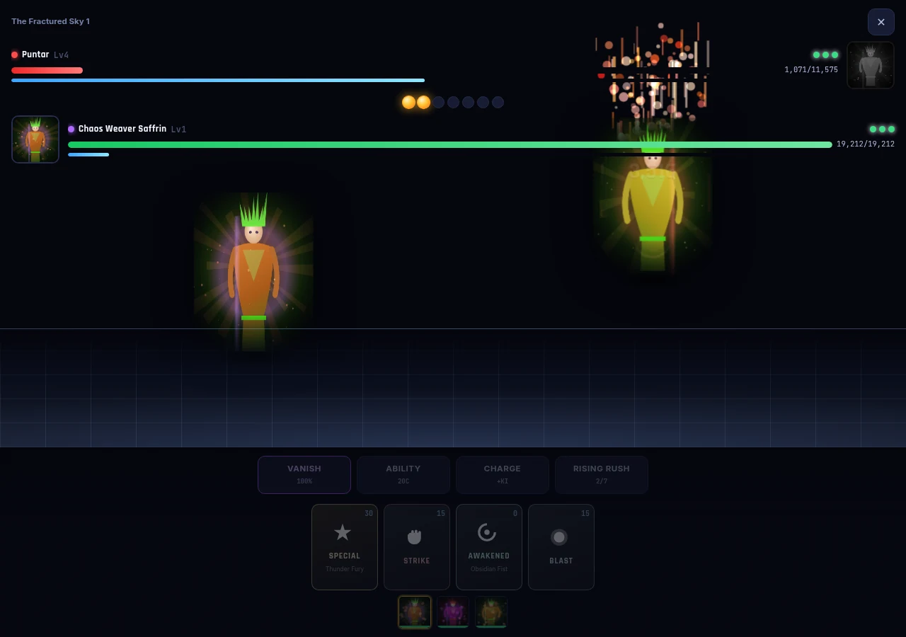
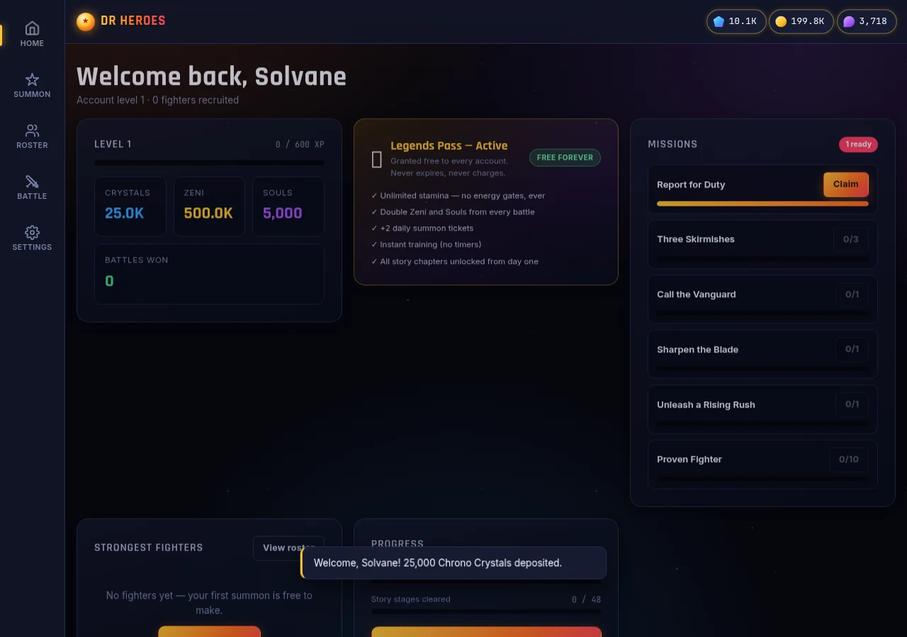
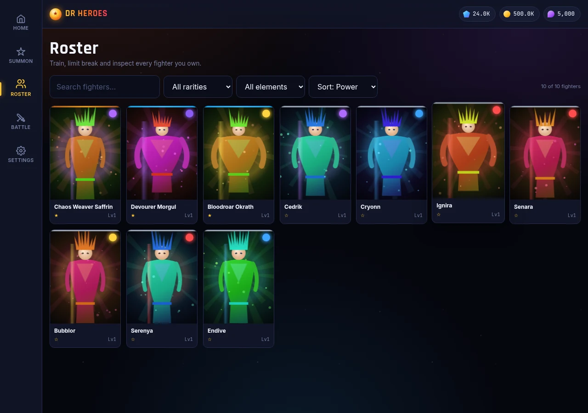

<p align="center">
  
</p>

<h1 align="center">🚀 Dragon Rush Heroes</h1>

<p align="center">
  <strong>An original anime action-RPG card battler. 464 fighters, real-time Arts
  combat, provably-fair summons — and no monetisation of any kind.</strong>
</p>

<p align="center">
  <a href="https://github.com/DLinacre/dragon-rush-heroes/actions/workflows/ci.yml"></a>
  
  
  
  
  
  
</p>

<p align="center">
  <a href="https://dlinacre.github.io/dragon-rush-heroes/"><strong>▶ Play the demo in your browser</strong></a>
  &nbsp;·&nbsp;
  <a href="#quick-start">Run it locally</a>
  &nbsp;·&nbsp;
  <a href="docs/PRD.md">Read the PRD</a>
</p>

> **100% original IP.** Every character, name, move and pixel of artwork in
> this project is original — there are no third-party assets and no image files
> at all (portraits are generated procedurally at runtime).
> See [`docs/LEGAL.md`](docs/LEGAL.md).

---

## Quick start

```bash
cd dragon-rush-heroes
node server/index.js          # → http://localhost:3000
```

That is the entire setup. **There is no `npm install`** — the project has zero
runtime dependencies.

```bash
npm test              # 86 unit + integration tests   (~2 s)
npm run smoke         # 25 deployment health checks   (~1 s)
node tests/e2e.js     # 25 browser tests              (needs Chrome)
```

---

## What makes it different

The premium games in this genre are excellent products wrapped around a hostile
economy. This build keeps the depth and deletes the extraction.

| | Genre standard | Dragon Rush Heroes |
|---|---|---|
| Starting currency | Buy at ~£40 / 2,000 | **25,000 free** (~£500 equivalent) |
| Premium pass | ~£8/month, auto-renews | **Free, permanent** |
| Stamina | 60 cap, regenerates slowly | **Unlimited** |
| Play session | Gated by energy | **Unbounded** |
| Summon fairness | "Trust us" | **Cryptographically verifiable** |
| Ads | Rewarded video | **None** |
| Roster | 400+ | **464** |

Your 25,000-crystal grant is **25 ten-pull multis**. A simulated grant spend
yields roughly **167 unique fighters including an Ultra and 6 Legends** before
you fight a single battle.

---

## Features

### Combat
Server-authoritative 3v3 card battler. Draw Arts cards, spend Ki, chain combos,
dodge with Vanishing Step, cover-change to save a dying ally, charge the Unique
Gauge, and fill seven Rush Orbs to trigger the Rising Rush.

- Seven-element wheel (Crimson → Solar → Void → Verdant → Tidal → Crimson, plus
  Umbral and Radiant) at 1.5× / 0.65×
- Five Arts types, three-card combo chains, critical hits, Endurance survival
- Data-driven abilities: 16 effect types across 9 trigger conditions
- Fully deterministic — every battle is replayable from its seed
- Keyboard controls: `1`-`4` cards, `V` vanish, `R` rush, `C` charge

### Collection
464 fighters across 80 lineages and 5 rarities, each with unique stats,
signature moves, ability kits, Z-Ability team buffs and a Unique Gauge.
Duplicates convert to Z-Power toward a 7-star limit break.

### Provably-fair gacha
Outcomes derive from `HMAC-SHA512(serverSeed, clientSeed:nonce:cursor)`. The
server seed's hash is published *before* you pull; rotate your own client seed
whenever you like. When the server seed rotates, its plaintext is revealed so
every historical pull can be independently recomputed.

### Zero-asset artwork
Every portrait is drawn on a `<canvas>` from a seed. The repository contains
**no image files** — 464 unique characters in roughly 190 KB of code.

---

## Screenshots

| Summon reveal | Battle arena |
|---|---|
|  |  |

| Dashboard | Roster |
|---|---|
|  |  |

---

## Architecture

```
server/
├── core/      HTTP kernel, crypto, validation, logging, errors
├── domain/    content (464 fighters) · combat engine · economy   ← pure, no I/O
├── data/      WAL store + repository seam
├── services/  auth · game (transaction boundaries)
└── routes/    26 endpoints

public/
├── app/core/  api · store · ui · portrait renderer · VFX engine
└── app/views/ auth · home · summon · roster · battle · settings
```

Dependencies point downward only. `domain/` imports nothing from the layers
above it, which is why the combat engine is testable without a server.

**Storage:** an embedded document store with a write-ahead log and atomic
snapshots — ACID-ish durability, no native modules.
[`db/schema.sql`](db/schema.sql) holds the equivalent PostgreSQL DDL (validated
against a live PostgreSQL 17) for the scale-out path; only
`data/repositories.js` would change.

---

## Configuration

| Variable | Default | Notes |
|---|---|---|
| `PORT` | `3000` | |
| `HOST` | `0.0.0.0` | |
| `NODE_ENV` | `development` | |
| `DATA_DIR` | `./.data` | Snapshot + WAL location |
| `SESSION_SECRET` | dev-derived | **Required in production**, ≥ 32 chars |
| `GACHA_SECRET` | dev-derived | **Required in production**, ≥ 32 chars |
| `CORS_ORIGINS` | *(empty)* | Comma-separated allow-list |
| `LOG_LEVEL` | `debug` / `info` | |

The process **refuses to boot in production** without real secrets — a
deliberate fail-fast, since ephemeral secrets would invalidate every session on
restart.

---

## Deployment

```dockerfile
FROM node:20-alpine
WORKDIR /app
COPY package.json ./
COPY server ./server
COPY public ./public
ENV NODE_ENV=production
EXPOSE 3000
VOLUME /app/.data
HEALTHCHECK --interval=30s CMD wget -qO- http://localhost:3000/api/health || exit 1
CMD ["node", "server/index.js"]
```

```bash
docker run -d -p 3000:3000 \
  -e SESSION_SECRET="$(openssl rand -hex 32)" \
  -e GACHA_SECRET="$(openssl rand -hex 32)" \
  -v drh-data:/app/.data \
  dragon-rush-heroes
```

---

## Security posture

- scrypt password hashing (N=2¹⁵) with per-user salts
- Session tokens stored **only as SHA-256 digests**
- Signed double-submit CSRF on every unsafe method
- Strict CSP with no `unsafe-inline` for scripts
- Schema validation on every input; mass assignment structurally impossible
- Per-account and per-IP rate limiting
- Append-only currency ledger; economy invariants enforced in the database
- GDPR export and erasure, cascade-verified

Full detail in [`docs/SECURITY.md`](docs/SECURITY.md).

---

## Testing

**137 automated checks**, all passing locally.

```
node tests/run.js     →  86/86   unit + integration   (~2 s)
node tests/smoke.js   →  25/25   deployment health    (~1 s)
node tests/e2e.js     →  26/26   browser end-to-end   (~30 s, real Chrome)
```

Continuous integration runs the same three suites across Node 18, 20 and 22
on every push — see [`.github/workflows/ci.yml`](.github/workflows/ci.yml).


| Suite | Count | Covers |
|---|---|---|
| Unit | 56 | Crypto, validation, store transactions, combat invariants, content generation, economy maths |
| Integration | 30 | Real HTTP: auth, CSRF, rate limits, economy accuracy, traversal, ownership |
| Smoke | 25 | Health, security headers, catalogue integrity, free-forever charter |
| E2E | 26 | Real Chrome: full journey, portrait rendering, complete battle, mobile layout, zero console errors |

Bugs these caught during development: a combat deadlock state, two CSP
violations, an empty battle stage, a blown-out screen flash, and a PostgreSQL
rule that silently broke GDPR account deletion.

---

## Documentation

| Document | Contents |
|---|---|
| [`docs/PRD.md`](docs/PRD.md) | Personas, journeys, functional requirements |
| [`docs/ARCHITECTURE.md`](docs/ARCHITECTURE.md) | ADRs, module boundaries, folder tree, request lifecycle |
| [`docs/API.md`](docs/API.md) | All 26 endpoints, state management, component hierarchy |
| [`docs/SECURITY.md`](docs/SECURITY.md) | Threat model, controls, testing strategy |
| [`docs/IMPLEMENTATION.md`](docs/IMPLEMENTATION.md) | Three-phase build plan with verification gates |
| [`docs/LEGAL.md`](docs/LEGAL.md) | **IP position and pre-publication checklist** |

---

## Project stats

| | |
|---|---|
| Source files | 34 |
| Lines of code | ~11,000 |
| Runtime dependencies | **0** |
| Fighters | **464** |
| Story stages | 48 |
| Image assets | **0** (procedural) |
| API endpoints | 26 |
| Automated checks | **137** |
